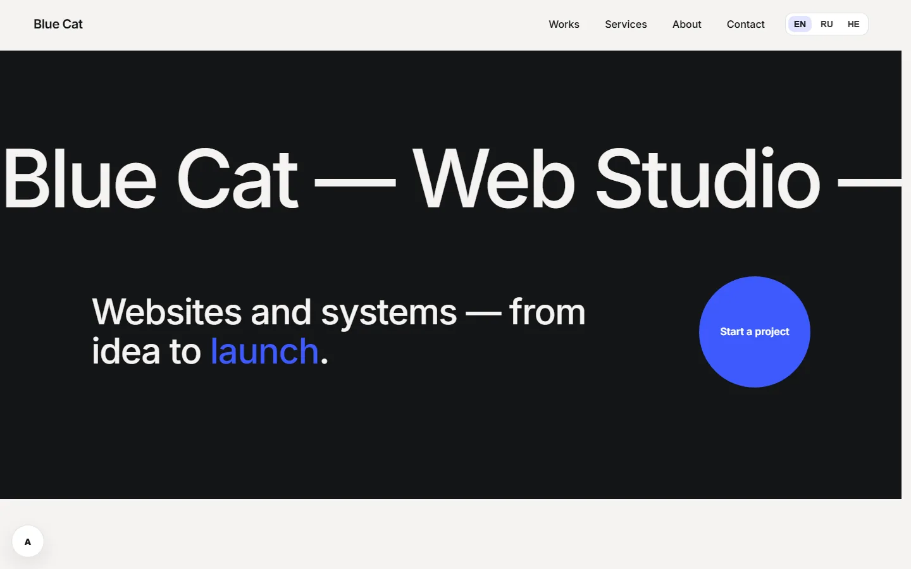
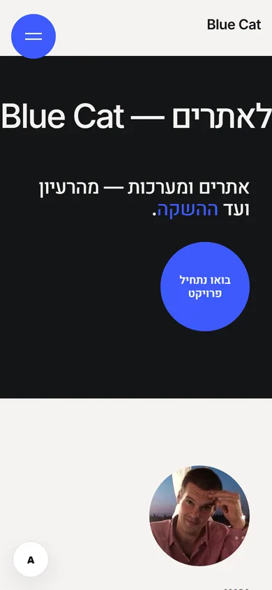
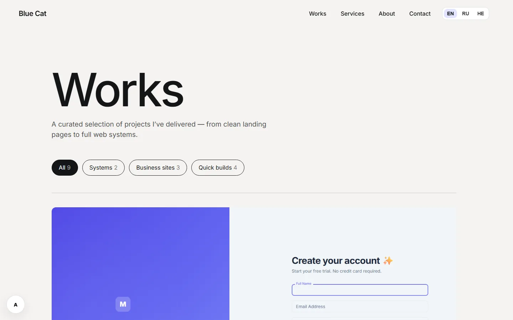

<div align="center">

# Blue Cat — bluecat.cc

**Personal portfolio and freelance site of Evgeny Nemchenko, full-stack developer.**
A motion-driven, trilingual (EN / RU / HE with full RTL) React site, built test-first and shipped by CI.

[**Live site → bluecat.cc**](https://bluecat.cc) ·
[LinkedIn](https://www.linkedin.com/in/evgeny-nemchenko) ·
[nevgeny90@gmail.com](mailto:nevgeny90@gmail.com)

[](https://github.com/Jony251/land_site/actions/workflows/deploy.yml)


</div>

<p align="center">
  
  &nbsp;
  
</p>

## What this project shows

| | |
|---|---|
| **Motion system** | Smooth scroll (Lenis on the GSAP ticker), line-by-line text reveals (SplitText), magnetic buttons, a scroll-velocity marquee, a pointer-following project preview and curtain page transitions. Every animation lives inside `useGSAP()` and is cleaned up on unmount. |
| **Accessibility** | Motion switches off completely for the OS *reduced motion* setting **and** for the site's own accessibility widget. High-contrast mode, text scaling, focus moved to the new page's `<h1>` after every navigation, a focus-trapped full-screen menu, WCAG AA contrast checked in a real browser. Lighthouse accessibility: **100**. |
| **i18n + RTL** | English, Russian and Hebrew with a mirrored right-to-left layout, built on logical CSS properties. A parity test guarantees every key exists in every language, and a "voice" test keeps all copy in the first person. |
| **Testing** | **411 Vitest + Testing Library tests**: unit and component tests, contract tests that run the *real* GSAP library where mocks would hide bugs, CSS contract tests that compute WCAG contrast from the stylesheets, and fitness tests (e.g. no raw router links, asset size budgets). Tests were mutation-checked: deliberately broken code must make them fail. |
| **Performance** | Self-hosted variable fonts, WebP screenshots, a 960 KB `public/` folder (down from 14 MB). Lighthouse mobile performance **90–92**, LCP ≈ 3 s. |
| **Delivery** | GitHub Actions installs, runs the tests and the build on Node 22, then rsyncs the static build to an AWS Lightsail instance behind Nginx and Cloudflare. Every push to `main` is a deploy. |

<p align="center">
  
</p>

## Engineering process

The redesign was planned and built the way I run production work, with a team of AI agents under my direction:

1. **Spec → plan.** A written design spec, then an implementation plan split into small, independently reviewable tasks (14 tasks in 4 phases for the pages alone).
2. **TDD per task.** A QA agent writes failing tests first and proves they fail for the right reason, a developer agent writes the minimum code to pass them, and a reviewer agent checks the result against the spec.
3. **Review in a real browser.** Every phase was reviewed in headless Edge across 3 languages, 320–1440 px widths, motion on/off and high-contrast mode before it shipped. That is where the bugs a jsdom test cannot see were caught: unreadable text on dark sections, a page-transition race on the Back button, Russian words pushing phones sideways.
4. **Decisions stay human.** I own the architecture, the design calls and every trade-off; each one is recorded with its cost if wrong.

The design spec and the implementation plans for this redesign are in [`docs/superpowers/`](docs/superpowers/).

## Tech stack

**Frontend:** React 19 · React Router 7 · Vite (rolldown) · plain CSS with design tokens
**Motion:** GSAP 3 (ScrollTrigger, SplitText, `@gsap/react`) · Lenis
**Testing:** Vitest 5 · Testing Library · user-event · jsdom
**Tooling & delivery:** ESLint 9 · GitHub Actions · AWS Lightsail · Nginx · Cloudflare · Docker for local builds
**Other:** EmailJS contact form · self-hosted Inter and Heebo variable fonts

## Project structure

```
land_site/
  src/
    motion/        GSAP registry, SmoothScroll, RevealText, Magnetic, Marquee,
                   HoverPreviewList, PageTransition + TransitionLink
    pages/         Home, Works, case study (in_Work/), Services, About, Contact, 404
    Components/    Nav, ContactFooter, ServiceRows, OwnerPhoto, a11y widget, …
    i18n/          translations (en / ru / he), LanguageProvider, parity + voice tests
    a11y/          AccessibilityProvider (reduce motion, high contrast, text size)
    test/          test helpers, GSAP test double, CSS rule reader for contract tests
  public/          static assets (WebP project screenshots, mascot)
.github/workflows/ deploy.yml: install → test → build → rsync
docs/              design spec and plans (superpowers/), README screenshots
```

## Run locally

Requires **Node 22.12+**.

```bash
cd land_site
npm ci
npm run dev        # http://localhost:5173
npm test           # 411 tests
npm run lint
npm run build && npm run preview
```

Optional environment variables (in `land_site/.env`): `VITE_EMAILJS_SERVICE_ID`, `VITE_EMAILJS_TEMPLATE_ID`, `VITE_EMAILJS_PUBLIC_KEY` for the contact form, `VITE_CONTACT_EMAIL` and `VITE_WHATSAPP_URL` for the contact links.

Docker (Nginx serving the production build), from `land_site/`: `docker compose up --build` → http://localhost:8080.

## Contact

Open to full-stack and frontend roles, and to freelance projects.

- **Site:** [bluecat.cc](https://bluecat.cc)
- **LinkedIn:** [linkedin.com/in/evgeny-nemchenko](https://www.linkedin.com/in/evgeny-nemchenko)
- **Email:** [nevgeny90@gmail.com](mailto:nevgeny90@gmail.com)
- **GitHub:** [@Jony251](https://github.com/Jony251)
